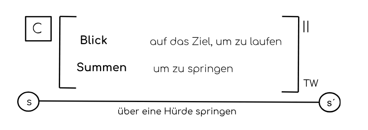

# Multimodale Mensch-Maschine-Interaktion

## 👩‍💻 Bearbeiterin
**Name:** Dana Lenzig  
**Matrikelnummer**: 57011  

---

## 📘 Quelle

**All Birds Must Fly: The Experience of Multimodal Hands-free Gaming with Gaze and Nonverbal Voice Synchronization**

In dem Paper „All Birds Must Fly: The Experience of Multimodal Hands-free Gaming with Gaze and Nonverbal Voice Synchronizatioy“ untersuchten die Autorinnen und Autoren, ob Computerspiele vollständig freihändig gesteuert werden können – also nur durch Blickbewegungen und nichtverbale Stimmeingaben wie Summen. Ziel war es, eine intuitive und barrierefreie Steuerung zu entwickeln, die auch für Menschen mit körperlichen Einschränkungen geeignet ist.

Dazu wurde ein eigenes 2D-Spiel entwickelt, in dem ein Pinguin durch Blickrichtung gesteuert und durch Summen zum Springen gebracht wird. In einer ersten Studie mit 15 Personen ohne Behinderung wurde diese Steuerung mit Maus und Tastatur verglichen, in einer zweiten Studie testeten 10 Personen mit motorischen oder sprachlichen Einschränkungen die Methode.

Die Ergebnisse zeigten, dass die Blick- und Stimmeingabe zwar langsamer, aber fast genauso präzise war wie die klassische Steuerung. Zudem wurde sie von den Teilnehmenden als spannender, unterhaltsamer und immersiver empfunden. Auch Personen mit Behinderungen konnten das Spiel erfolgreich bedienen.

Insgesamt zeigt die Studie, dass die Kombination aus Eye Tracking und nichtverbaler Stimmeingabe ein vielversprechender Ansatz für inklusive und freihändige Interaktionen ist, der sich über Spiele hinaus in weiteren digitalen Anwendungen einsetzen lässt.

---

## 🧠 AMITUDE-Modell
(A:) Ein 2D-Spiel namens “All Birds Must Fly”, (U:) in dem vor allem Personen mit motorischen oder sprachlichen Einschränkungen (T:) einen Pinguin durch Level steuern. (M:) Dies geschieht über Blicksteuerung und nichtverbale Stimmeingabe (D:) mithilfe von Eye-Tracker und Mikrofon (E:) auf einem Laptop, (I:) wobei das System auf Eingaben reagiert und visuelles Feedback am Bildschirm gibt.

---

## 🧮 CARE-Modell
 

---

## 🧩 CASE-Modell
Die Bewegungen des Pinguins werden CONCURRENT verarbeitet. .

---

## 🔗 Literaturverzeichnis
Ramin Hedeshy, Chandan Kumar, Mike Lauer, and Steffen Staab (2022).  
*All Birds Must Fly: The Experience of Multimodal Hands-free Gaming with Gaze and Nonverbal Voice Synchronization.*  
In: Proceedings of the 2022 International Conference on Multimodal Interaction (ICMI '22).  
[https://doi.org/10.1145/3536221.3556593](https://doi.org/10.1145/3536221.3556593)
